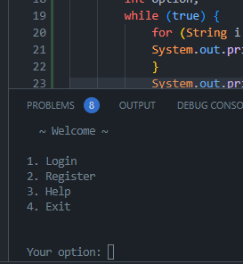

It's still a work in progress...

Use the sql file located in resources folder,
to create the database needed for this application.

For the best user expierience, adjust terminal height right under line 23.

